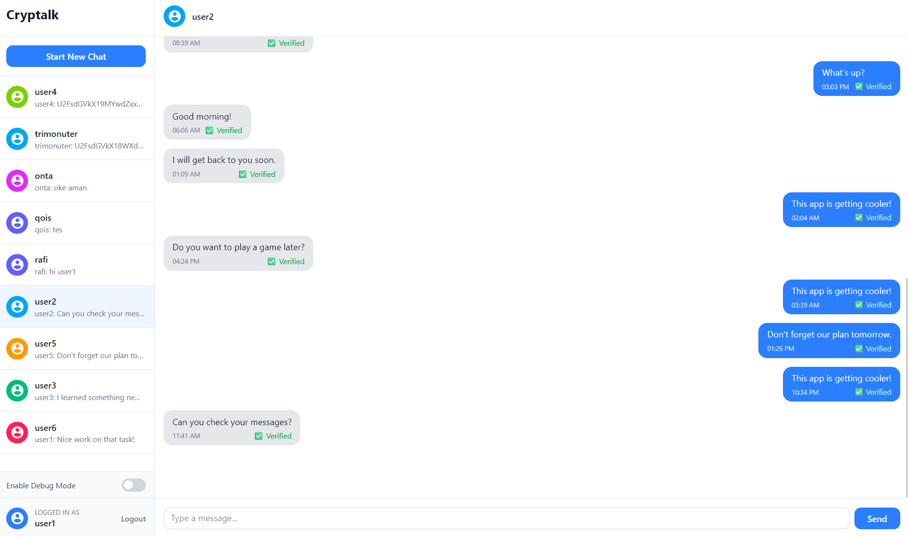

# Cryptalk

> Tugas Besar IF4020 Kriptografi

Cryptalk is an end-to-end encrypted chat application for secure messaging. It leverages modern cryptographic techniques including encryption, hashing, and digital signatures to ensure privacy and data integrity for all users.

**Production URL:** [http://135.235.216.233:3000/login](http://135.235.216.233:3000/login)



---

## Tech Overview

| Category               | Technologies/Libraries                     |
| ---------------------- | ------------------------------------------ |
| Cryptography Libraries | crypto-js, elliptic, js-sha3, jsonwebtoken |
| Backend                | Node.js (Express), Drizzle ORM, Socket.IO  |
| Frontend               | React, Vite, Zustand                       |
| Database               | PostgreSQL                                 |
| Deployment             | AzureVM                                    |

## How to Run Locally

### Dependencies

To run the application locally, you must have the following installed:
| Dependency | Description |
| ---------------- | ------------------------------------------------ |
| Docker & Compose | Containerization |

### Using Docker Compose

1. **Start the application:**

   ```bash
   docker-compose up --build
   ```

2. **Seed the database (first time setup):**
   ```bash
   docker-compose exec -it backend npm run db:seed
   ```

### How to Access

- **Frontend**: [http://localhost:3000](http://localhost:3000) - Main application
- **Backend API**: [http://localhost:3001](http://localhost:3001) - REST API endpoints

## Developers

| Name                           | NIM      |
| ------------------------------ | -------- |
| Ahmad Rafi Maliki              | 13522137 |
| Muhammad Dzaki Arta            | 13522149 |
| Muhammad Rasheed Qais Tandjung | 13522158 |
